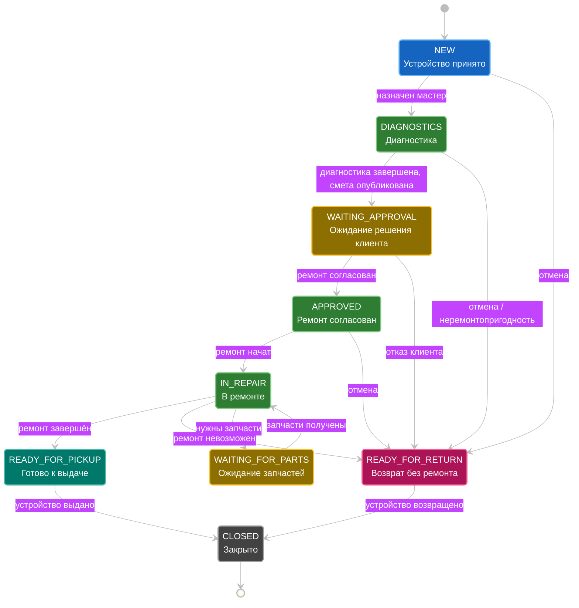

# RepairDesk — система управления сервисным центром по ремонту электроники

> **Проблема:**
> Сервисному центру нужно отслеживать ремонт устройства от приёма до выдачи. 
> Менеджер регистрирует обращение и назначает мастера. 
> Мастер проводит диагностику и составляет смету. 
> Менеджер фиксирует решение клиента, после чего мастер выполняет согласованные работы. 
> Система хранит состояние заказа и историю изменений.

> **Статус:** проектирование. Создан базовый Java/Gradle-проект с Gradle Wrapper. Бизнес-функции, Spring Boot приложение, подключение БД и тесты пока не реализованы. Ниже описано планируемое поведение.

## Роли и их основные действия

| Роли       | Действия                                                                                            |
|------------|-----------------------------------------------------------------------------------------------------|
| ADMIN      | Управление сотрудниками, каталогами, складом; операционные права менеджера                          |
| MANAGER    | Клиенты, устройства, заказы, назначения, публикация сметы, фиксация решения клиента, оплаты, выдача |
| TECHNICIAN | Назначенные ему заказы: диагностика, черновик сметы, выполнение, детали, заметки                    |
| CLIENT     | Приносит устройство, согласует/отклоняет ремонт через менеджера                                     |

> [!NOTE]
> Системные роли: ADMIN, MANAGER, TECHNICIAN. Клиент — внешний участник процесса без учётной записи. 
> Управление складом, учёт оплат и работа с запчастями относятся к этапу следующему после MVP-этапа.

## Границы MVP

| В MVP                                                                                             | Позже                   |
|---------------------------------------------------------------------------------------------------|-------------------------|
| Один сервисный центр, без филиалов и multitenancy                                                 | Склад запчастей         |
| Внутреннее приложение для сотрудников; клиент взаимодействует через менеджера и не имеет аккаунта | Учёт оплат              |
| Валюта — EUR, диагностика бесплатная                                                              | Вложения                |
| Клиенты и устройства                                                                              | Необязательный frontend |
| Заказы и назначение мастера                                                                       | Клиентский кабинет      |
| Диагностика и смета услуг                                                                         |                         |
| Согласование и выдача                                                                             |                         |
| Роли и ограничения доступа                                                                        |                         |
| На устройство допускается один активный заказ                                                     |                         |
| Оплата учитывается вне системы; банковский эквайринг не входит в проект                           |                         |

## Workflow



### Пример успешного сценария:

- Ремонт выполнен, устройство успешно выдано
```text
NEW
→ DIAGNOSTICS
→ WAITING_APPROVAL
→ APPROVED
→ IN_REPAIR
→ READY_FOR_PICKUP
→ CLOSED
```

### Примеры отказа:

- Клиент отказался от ремонта на этапе согласования
```text
NEW
→ DIAGNOSTICS
→ WAITING_APPROVAL
→ READY_FOR_RETURN
→ CLOSED
```

- Клиент отказался от ремонта на этапе ожидания запчатей
```text
NEW
→ DIAGNOSTICS
→ WAITING_APPROVAL
→ APPROVED
→ IN_REPAIR
→ WAITING_FOR_PARTS
→ READY_FOR_RETURN
→ CLOSED
```

- Отказ в связи с невозможностью ремонта устройства(неремонтопригодность)
```text
NEW
→ DIAGNOSTICS
→ READY_FOR_RETURN
→ CLOSED
```

- Отказ в связи с невозможностью ремонта устройства на этапе ремонта
```text
NEW
→ DIAGNOSTICS
→ WAITING_APPROVAL
→ APPROVED
→ IN_REPAIR
→ READY_FOR_RETURN
→ CLOSED
```

### Правила расчёта стоимости и сохранения цены:
1. В смете согласована одна услуга за 60,00 EUR. 
    После изменения цены в каталоге на 70,00 EUR согласованная стоимость 
    остаётся 60,00 EUR: строка сметы хранит снимок цены.
2. Общая стоимость в смете высчитывается из суммы всех цен согласованных услуг и их количества
3. Смета хранит список услуг со снимками цен этих услуг на момент согласования
4. При публикации смета фиксируется и больше не редактируется.
5. Клиент согласует уже опубликованную смету.
6. Согласованная и фактическая суммы рассчитываются отдельно.
    * estimateTotal = Σ(unitPrice × plannedQuantity)
    * finalTotal    = Σ(unitPrice × actualQuantity)

> [!NOTE]
> Пример: согласованы две единицы услуги по 30 EUR — смета 60 EUR. 
> Если из-за технической невозможности выполнена только одна, итог — 30 EUR, 
> результат — UNREPAIRABLE. При отказе до начала работ итог — 0 EUR.

> [!NOTE]
> Для цены BigDecimal, EUR, точность до двух десятичных знаков.

### Связи сущностей:
- Один клиент → несколько устройств.
- Одно устройство → несколько заказов за всё время.
- Одно устройство → максимум один незакрытый заказ.
- Один заказ → максимум один назначенный мастер.
- Заказ → 0..N строк заказа.
- Строка заказа → одна услуга из каталога в MVP.
- Строка хранит снимок цены, плановое и фактическое количество.
- Заказ → 0..1 опубликованная смета.
- Опубликованная смета → 0..1 решение клиента.
- менеджер публикует непустую смету после диагностики
- назначенный мастер начинает ремонт после согласия клиента

> [!NOTE]
> - status показывает текущий этап 
> - outcome — результат ремонта. 
> - При выдаче статус становится CLOSED, а результат сохраняется. 
> - Отказ клиента сам по себе заказ не закрывает.